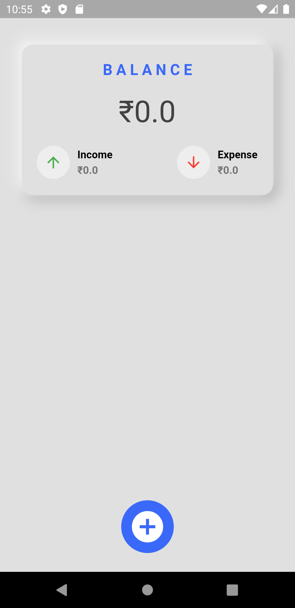
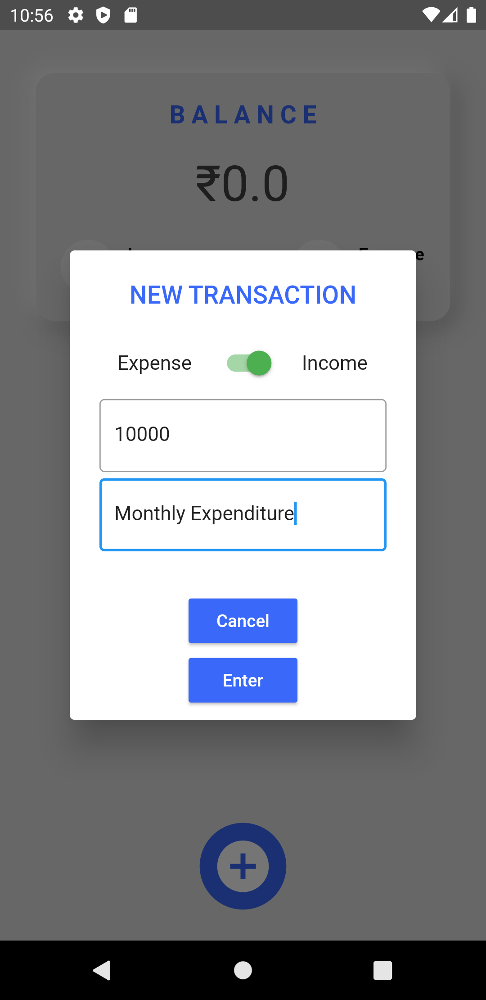
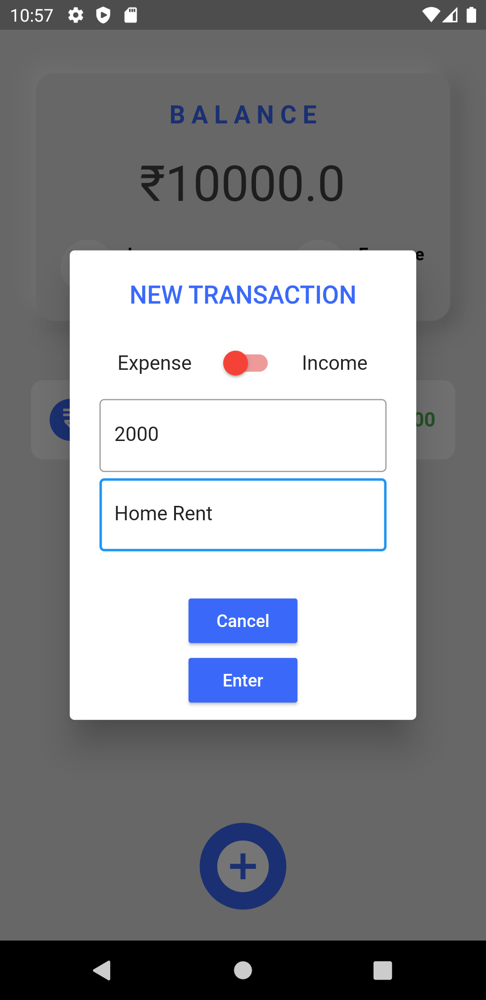
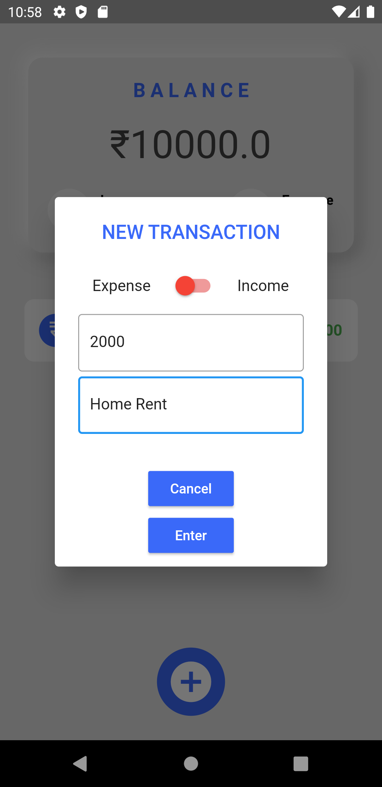
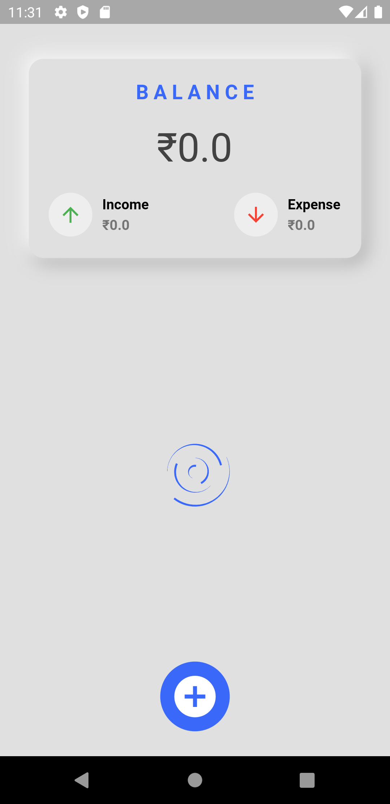
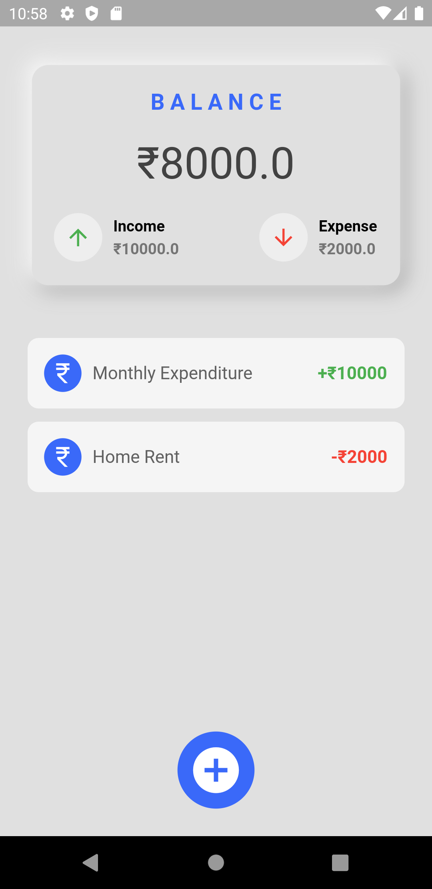

# Expense 💸 Tracker Flutter App 💲

<h3><i>
A Flutter App which helps users to track their expenses during the month, 
Which uses Google Sheets & Cloud console as their Backend to store the data of all the expenditures.</i></h3>

Features of this App are: ⏬

1. A Neumorphic flutter card designs, with An Animated Spiral Loader.
2. Shows Total Balance, Incomes and Expenses with Green and Red updown indicators.⬆️⬇️
3. List View of all the expenditures with their title and Income/Expensed. 💰💸
4. An Add Button for the New Transactions, where you can add your recent Incomes/Expenses with the coloured Toggle, Red for expenses and Green for income.

📌 I've tried to use CRUD operations Creat & Read implemented, soon Update and Delete options will be in action. Where we can change the data of given expenditures.

## Screenshots 📱

|  |  |  |
| --------------------------- | --------------------------- | --------------------------- |
|  |  |  |

## Thanks To Visit 🥰
